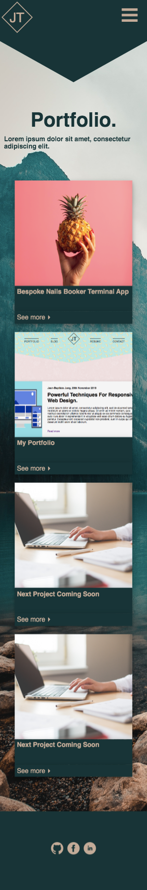

# Jade Tyrer Website Portfolio
Portfolio URL: https://jade-tyrer.netlify.com/index.html
Github URL: https://github.com/jadetyrer/portfolio
Moodboard URL: https://www.pinterest.com.au/jadetyrer18/portfolio/

## Purpose and Target Audience

The purpose of this portfolio is demonstrate to potential employers my skills via the website itself and through the links to my projects. The development of the website communicates my HTML and CSS abilities and links to other projects displays my skills in other areas and can be continuously updated going forward. My resume will be available to download for further information on my previous work history and other skills. The target audience will be potential employers looking to hire an IT professional. 

## Functionality and Features

###### Header and Footer
One of the main features of my site is the nav bar which makes it easy to navigate around the website. The nav bar includes my logo in the center which links back to the homepage. I created the header in a polygon shape instead of the usual rectangle to make my design unique and grab the attention of the user. 

When viewed in mobile view I ensured functionality of the website by changing the navigation bar to a burger menu. The burger menu is a drop down menu that displays the other page links. I wanted to keep my logo on show when the nav-bar changes so this was removed the from the drop down and displayed in the opposite corner to the nav-bar. This feature benefits the users through ease of navigation but also contributes to the aesthetic design of the mobile view. 

The footer includes the navigation bar links to increase accessability to other pages from all areas and encourages the used to keep clicking through the website. The footer also includes links to my social media, github and linked in accounts to ensure potential employers have access to any relevant information they need when hiring. The footer also includes the necessary copyright information. When the website is viewed through mobile view the navigation bar is removed to ensure the page is not overcrowded.

###### Homepage
I wanted to keep the homepage simple but eye catching and for the user to know exactly what the page contains and what to expect from the site. I used a fade in effect on the main headings to soften the bold headings and add to the user experience. The homepage also includes a picture and a short piece of text about myself to connect with the user on a personal level and give them enough information to keep them engaged in the website. I put these elements in an overlapping circle and a diamond to make them stand out and as a contrast to the symmetrical header. These elements are flex boxes achieved by changing the border radius to 50% for the picture using transform and rotate for the diamond. I changed the flex direction to column when in mobile view to ensure the page is responsive.

###### Portfolio
I created the portfolio page using the CSS grid layout. I made four equal columns with a grid gap and 3 rows that were spilt 3/5, 1/5 and 1/5 with no grid gap. This achieved the sizing for the cards I created for each of my current and future projects. I added pictures as a background image in CSS as this was the easiest way to achieve the sizing of the image I required. Each of the projects included a title and link below that would take the user to an external page with further information regarding the project. When viewed in mobile view I changed the layout of the grid to one column to make sure it was readable the images were still in shape. I then reordered the items in the grid to the correct order of picture shape and corresponding link. 

###### Blog
The blog page was created using flex box and I employed the reverse property to create a flex box and change the side of the picture and text for each blog post. This was to make it more interesting and add to aesthetic of the page. There is also a list of links to the blog with the title, date and picture of each blog to assist in navigation to the required element. The anchors attached to each item in the list will jump the page down to the corresponding blog post. Each blog post also includes a link to an external page with the entirety of the blog post. When in mobile view the flex direction of the blog sections and the list is changed to column. This way all elements fit on the page and the images maintain their shape. 

###### Resume
My resume page includes an image of the CV increase the chance of the potential employer learning of my other skills and work experience. If any of the users are worried about downloading from the internet the information is displayed for them on the webpage. There is also a link to download a PDF if the user is interested in hiring they can keep a copy to share with others making the decision. When the resume page is viewed on a mobile the image of the CV is not displayed as the quality of the information is not maintained but the user may still download a PDF via mobile. 

###### Contact
The final page is a contact page. This is created in order for the potential employers to get in contact. The contact form includes a space for them to enter their details and a message and a submit button. Having this page makes it easy for the employer to reach out without finding the contact details via the CV. This elements increases the chance of achieving the overall aim of the website portfolio which is for potential employers to get in contact. When in mobile view the all sections of the contact form align in a column making it easier to read and fill in. 

## Tech Stack
- HTML
- CSS
- Github
- Netlify

## Sitemap 

## Wireframes

###### Homepage

###### Portfolio page 

###### Blog page

###### Resume page

###### Contact page

## Webpages 

###### Homepage

<b>Mobile</b>
 

###### Portfolio page 

<b>Mobile</b>

###### Blog page

<b>Mobile</b>

###### Resume page

<b>Mobile</b>

###### Contact page

<b>Mobile</b>

## Design Variations
###### Branch 1

###### Branch 2

## Challenges
- Responsiveness 
- starting without wireframe/mock up
- 

